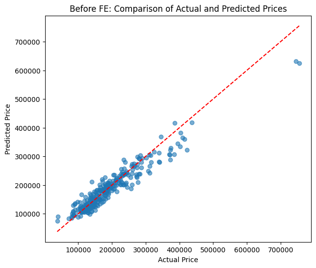
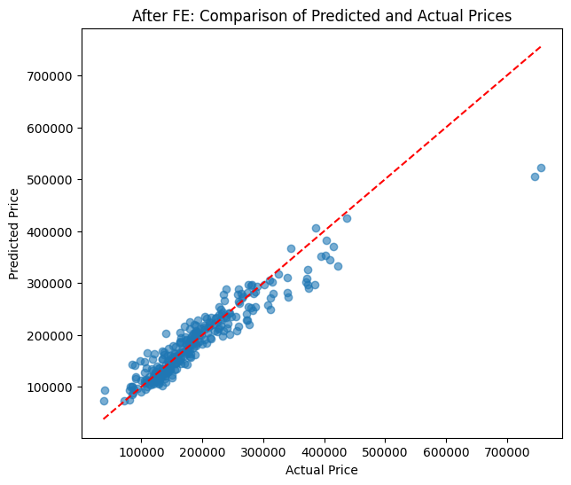

# House Price Prediction | [Kaggle link](https://www.kaggle.com/competitions/house-prices-advanced-regression-techniques/overview) | [view code](https://github.com/Matsalak-Viktoria/House-Price-Prediction/blob/main/House_Price_Prediction.ipynb)

## Overview
This project explores the implementation and evaluation of a machine learning pipeline for predicting house prices using the Ames Housing Dataset from Kaggle.

The main goal of the project is not only to build a predictive regression model, but also to compare Lasso Regression performance before and after applying feature engineering techniques.

The project focuses on the following prediction task:
- House Price Prediction – Predicting residential property prices based on numerical and categorical house characteristics.

## Objectives
The main objectives of this project are:
- Perform Exploratory Data Analysis (EDA) to understand feature distributions and relationships with the target variable.
- Build a machine learning pipeline for house price prediction using the Ames Housing dataset.
- Investigate how feature engineering affects the performance of a Lasso Regression model.
- Analyze the experimental results by comparing model performance before and after feature engineering.

## Dataset
- **SalePrice**: - The property's sale price in dollars. This is the target variable that you're trying to predict.
- **MSSubClass**: The building class.
- **MSZoning**: The general zoning classification.
- **LotFrontage**: Linear feet of street connected to property.
- **LotArea**: Lot size in square feet.
- **Street**: Type of road access.
- **Alley**: Type of alley access.
- **LotShape**: General shape of property.
- **LandContour**: Flatness of the property.
- **Utilities**: Type of utilities available.
- **LotConfig**: Lot configuration.
- **LandSlope**: Slope of property.
- **Neighborhood**: Physical locations within Ames city limits.
- **Condition1**: Proximity to main road or railroad.
- **Condition2**: Proximity to main road or railroad (if a second is present).
- **BldgType**: Type of dwelling.
- **HouseStyle**: Style of dwelling.
- **OverallQual**: Overall material and finish quality.
- **OverallCond**: Overall condition rating.
- **YearBuilt**: Original construction date.
- **YearRemodAdd**: Remodel date.
- **RoofStyle**: Type of roof.
- **RoofMatl**: Roof material.
- **Exterior1st**: Exterior covering on house.
- **Exterior2nd**: Exterior covering on house (if more than one material).
- **MasVnrType**: Masonry veneer type.
- **MasVnrArea**: Masonry veneer area in square feet.
- **ExterQual**: Exterior material quality.
- **ExterCond**: Present condition of the material on the exterior.
- **Foundation**: Type of foundation.
- **BsmtQual**: Height of the basement.
- **BsmtCond**: General condition of the basement.
- **BsmtExposure**: Walkout or garden level basement walls.
- **BsmtFinType1**: Quality of basement finished area.
- **BsmtFinSF1**: Type 1 finished square feet.
- **BsmtFinType2**: Quality of second finished area (if present).
- **BsmtFinSF2**: Type 2 finished square feet.
- **BsmtUnfSF**: Unfinished square feet of basement area.
- **TotalBsmtSF**: Total square feet of basement area.
- **Heating**: Type of heating.
- **HeatingQC**: Heating quality and condition.
- **CentralAir**: Central air conditioning.
- **Electrical**: Electrical system.
- **1stFlrSF**: First Floor square feet.
- **2ndFlrSF**: Second floor square feet.
- **LowQualFinSF**: Low quality finished square feet (all floors).
- **GrLivArea**: Above grade (ground) living area square feet.
- **BsmtFullBath**: Basement full bathrooms.
- **BsmtHalfBath**: Basement half bathrooms.
- **FullBath**: Full bathrooms above grade.
- **HalfBath**: Half baths above grade.
- **Bedroom**: Number of bedrooms above basement level.
- **Kitchen**: Number of kitchens.
- **KitchenQual**: Kitchen quality.
- **TotRmsAbvGrd**: Total rooms above grade (does not include bathrooms).
- **Functional**: Home functionality rating.
- **Fireplaces**: Number of fireplaces.
- **FireplaceQu**: Fireplace quality.
- **GarageType**: Garage location.
- **GarageYrBlt**: Year garage was built.
- **GarageFinish**: Interior finish of the garage.
- **GarageCars**: Size of garage in car capacity.
- **GarageArea**: Size of garage in square feet.
- **GarageQual**: Garage quality.
- **GarageCond**: Garage condition.
- **PavedDrive**: Paved driveway.
- **WoodDeckSF**: Wood deck area in square feet.
- **OpenPorchSF**: Open porch area in square feet.
- **EnclosedPorch**: Enclosed porch area in square feet.
- **3SsnPorch**: Three season porch area in square feet.
- **ScreenPorch**: Screen porch area in square feet.
- **PoolArea**: Pool area in square feet.
- **PoolQC**: Pool quality.
- **Fence**: Fence quality.
- **MiscFeature**: Miscellaneous feature not covered in other categories.
- **MiscVal**: $Value of miscellaneous feature.
- **MoSold**: Month Sold.
- **YrSold**: Year Sold.
- **SaleType**: Type of sale.
- **SaleCondition**: Condition of sale.

## Workflow
The project workflow includes:
1. Exploratory Data Analysis (EDA)  
2. Feature Selection
3. Model Training and Evaluation (before feature engineering)
   - Train/Test split
   - Pipeline Setup
   - Cross-Validation with GridSearchCV
     - Data Preprocessing (Imputation, Encoding, Scaling)
     - Lasso Regression Model Training
     - Hyperparameter Optimization
   - Prediction on Unseen Test Data
   - Model Evaluation
4. Feature Engineering
5. Model Re-training and Re-evaluation (after feature engineering)
6. Result Analysis
   - Comparison of Model Performance Before and After Feature Engineering
   - Optimal Approach Selection

## Technologies
- Python
- Pandas
- NumPy
- Scikit-learn
- Matplotlib
- Seaborn

## Methods
### Data Preprocessing

**Numerical features**:
- Missing value imputation (Median)
- Feature scaling (StandardScaler)

**Categorical features**:
- Most frequent value imputation
- One-Hot Encoding
- OrdinalEncoder

### Machine Learning Model
- Lasso

**Hyperparameters optimized**:
- alpha

### Validation Strategy
**Nested Cross-Validation**:
- Outer CV for robust model evaluation
- Inner CV with GridSearchCV for hyperparameter optimization

### Evaluation Metrics
- MAE (Mean Absolute Error)
- RMSE (Root Mean Squared Error)

## Results
### Model Performance Before Feature Engineering:
- MAE:&ensp;19407
- RMSE: 27304

### Metric Analysis:
The Lasso Regression model performed quite well in predicting house prices. After tuning the optimal value of the regularization hyperparameter (alpha = 0.001), the metrics obtained on the test set were as follows:
- MAE ≈ 19,400 - on average, the model's predictions are off by approximately 19 thousand dollars;
- RMSE ≈ 27,300 - the average deviation of predictions from actual prices is about 27 thousand dollars.

These error values indicate that the model is capable of capturing the main relationships between the features and house prices; however, predictions can still deviate significantly from actual values. This is due to both the high variability in housing prices (different neighborhoods, quality, and additional factors) and the limited set of features used in the model.

Overall, the model successfully handled the task: it provides reasonably accurate predictions and can be used for approximate house price estimation. However, to achieve higher prediction accuracy, it would be advisable to test more complex algorithms and expand the feature set.

### Plot Analysis:
The plot shows that the model predicts prices quite well in the mid-range ($100k–$300k); however, it tends to underestimate predictions for high-end homes (>$400k). This indicates the model's limited ability to capture extreme values, which is typical for linear models.

### Model Performance After Feature Engineering:
- MAE:&ensp;19315
- RMSE: 31349

### Metric Analysis:
After adding new features (feature engineering), the mean absolute error (MAE) decreased from 19,408 to 19,315, indicating a slight improvement in prediction accuracy. However, the RMSE value increased from 27,304 to 31,349, meaning the model became slightly worse at handling rare large errors.

Overall, the engineered features helped the model better capture the key patterns between the features and the target variable, although its robustness to outliers decreased. This impact on RMSE highlights the need for further feature selection and potentially outlier handling to improve the model's stability.

### Plot Analysis:
The plot shows that after adding new features, the model maintains a fairly high prediction accuracy in the mid-price range. Most predictions are close to the actual values, indicating that the model correctly captures the key relationships between the house characteristics and its price. At the same time, for high-end properties, the model tends to underestimate predicted prices, which may be due to outliers or the limitations of the linear model.
